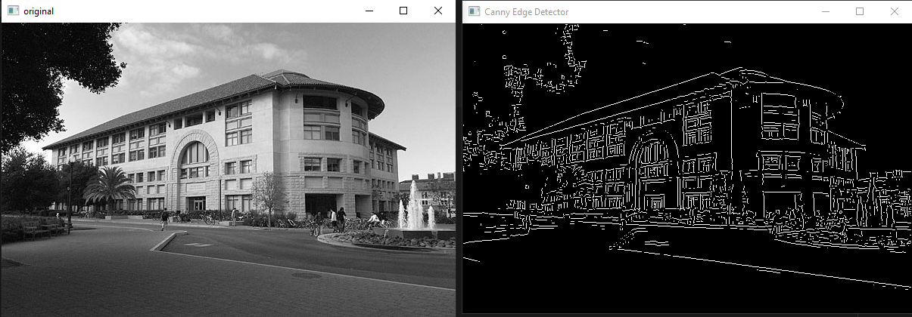

# Canny Edge Detector

This is a canny edge detector project that written in python.

Note: All intermediate computations — such as 2D convolution, Gaussian kernel generation, Gaussian blurring, and non-maximum suppression — are implemented natively in Python. This means that these operations are not highly optimized in terms of computational speed.

## Result

You can see the edge detected image with using this canny edge detector.

